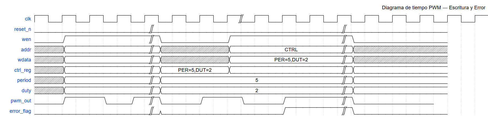

# Documentación RTL — Controlador PWM

## Propósito de la carpeta `rtl/`

Esta carpeta contiene el código RTL en Verilog-2001 de un controlador PWM de un canal, con interfaz de registro para configuración y estado.  
El diseño es modular, reutilizable y compatible tanto con síntesis como simulación.

---

## Estructura de módulos
rtl/
├── reg_if.v # Interfaz de registro de configuración y estado
├── pwm_core.v # Núcleo generador de señal PWM
└── top_pwm.v # Módulo top-level que conecta los anteriores


---

## 1. Módulo `reg_if.v` — Interfaz de registro

<details>
<summary><strong>Detalles del módulo</strong></summary>

Gestiona el acceso del procesador o bus de control a dos registros:
- **CTRL**: para configurar el valor del periodo y el ciclo de trabajo (duty cycle).
- **STATUS**: para reportar errores y el estado del módulo.

### Puertos principales

| Señal        | Dirección | Ancho                | Descripción                             |
|--------------|-----------|----------------------|-----------------------------------------|
| `clk`        | in        | 1                    | Reloj                                   |
| `reset_n`    | in        | 1                    | Reset activo bajo                       |
| `addr`       | in        | `ADDR_WIDTH`         | Dirección de acceso a registro          |
| `wdata`      | in        | `DATA_WIDTH`         | Datos de escritura                      |
| `rdata`      | out       | `DATA_WIDTH`         | Datos de lectura                        |
| `wen`        | in        | 1                    | Habilitación de escritura               |
| `ren`        | in        | 1                    | Habilitación de lectura                 |
| `ctrl`       | out       | `DATA_WIDTH`         | Valor actual del registro CTRL          |
| `status_in`  | in        | `DATA_WIDTH`         | Flags de error generados internamente   |
| `status`     | out       | `DATA_WIDTH`         | Valor actual de STATUS                  |

### Mapeo de registros

- **CTRL** (offset `0x00`):  
  - `[31:16]` → Período del PWM  
  - `[15:0]`  → Duty cycle (ancho de pulso)
- **STATUS** (offset `0x04`):  
  - `[0]`     → Flag de error (`duty > period`)  
  - `[31:1]`  → Reservado (0)
</details>

---

## 2. Módulo `pwm_core.v` — Núcleo PWM

<details>
<summary><strong>Detalles del módulo</strong></summary>

Genera la señal PWM a partir de dos parámetros:
- **Periodo:** Valor máximo del contador antes de reiniciar el ciclo PWM.
- **Duty cycle:** Ancho del pulso alto en cada periodo.

### Puertos principales

| Señal      | Dirección | Ancho           | Descripción                       |
|------------|-----------|-----------------|-----------------------------------|
| `clk`      | in        | 1               | Reloj                             |
| `reset_n`  | in        | 1               | Reset activo bajo                 |
| `period`   | in        | `WIDTH_PERIOD`  | Período del PWM                   |
| `duty`     | in        | `WIDTH_DUTY`    | Duty cycle (ancho de pulso alto)  |
| `pwm_out`  | out       | 1               | Salida digital PWM                |

### Descripción funcional

- El módulo contiene un contador que avanza con cada flanco de reloj.
- Cuando el contador llega a `period-1`, se reinicia a 0.
- La salida `pwm_out` está en alto (`1`) mientras `counter < duty`, y en bajo (`0`) el resto del periodo.
</details>

---

## 3. Módulo `top_pwm.v` — Integración top-level

<details>
<summary><strong>Detalles del módulo</strong></summary>

- Conecta la interfaz de registro y el núcleo PWM.
- Extrae de `CTRL` los valores de periodo y duty.
- Genera un flag de error si `duty > period`.
- Expone todo a través de una interfaz estándar.
</details>

---

## Diagrama de tiempo — Funcionamiento del controlador PWM

A continuación se muestra un **diagrama de tiempo representativo** del funcionamiento del PWM y su configuración mediante registros.  
Incluye el caso normal y la activación del flag de error cuando el duty es mayor al periodo.

### Vista gráfica

<!-- Inserta aquí la imagen exportada de WaveDrom -->


### Código WaveDrom

Puedes visualizar y modificar este diagrama en [wavedrom.com/editor.html](https://wavedrom.com/editor.html):

```json
{
  "signal": [
    { "name": "clk",      "wave": "p......|.............|.......", "period": 2 },
    { "name": "reset_n",  "wave": "l.......|.............|.......", "data": ["RESET"] },
    { "name": "wen",      "wave": "0.1.....|0....1.......|0......", "data": ["", "W", "", "", "W"] },
    { "name": "addr",     "wave": "x.=.....|x....=.......|x......", "data": ["", "CTRL", "", "", "CTRL"] },
    { "name": "wdata",    "wave": "x.=.....|x....=.......|x......", "data": ["", "PER=5,DUT=2", "", "", "PER=4,DUT=7"] },
    { "name": "ctrl_reg", "wave": "x.=.....|=....=.......|=......", "data": ["", "PER=5,DUT=2", "", "", "PER=4,DUT=7"] },
    { "name": "period",   "wave": "x.=.....|=............|=......", "data": ["", 5, "", "", 4] },
    { "name": "duty",     "wave": "x.=.....|=............|=......", "data": ["", 2, "", "", 7] },
    { "name": "pwm_out",  "wave": "0.1..0.1|0..1..0..1...|0.....", "data": ["PWM OK", "", "", "PWM Error"] },
    { "name": "error_flag","wave": "0.......|0........1...|0......", "data": ["", "", "Duty>Error"] }
  ],
  "edge": [
    "wen[CTRL] -> ctrl_reg",
    "ctrl_reg -> period",
    "ctrl_reg -> duty",
    "wen[CTRL] -> ctrl_reg[err]",
    "ctrl_reg[err] -> period[err]",
    "ctrl_reg[err] -> duty[err]",
    "pwm_out[err] -> error_flag"
  ],
  "head": {
    "text": "Diagrama de tiempo PWM — Escritura y Error"
  }
}
```

---

### Parámetros y convenciones

- **ADDR_WIDTH**: ancho del bus de direcciones (por defecto 8 bits).
- **DATA_WIDTH**: ancho de los registros de datos (por defecto 32 bits).
- **WIDTH_PERIOD / WIDTH_DUTY**: resolución del periodo y duty (por defecto 16 bits).

---

### Ejemplo de acceso (pseudo-código)

```c
// Configurar periodo=1000, duty=400
uint32_t ctrl = (1000 << 16) | 400;
write_reg(CTRL_ADDR, ctrl);

// Leer estado
uint32_t status = read_reg(STATUS_ADDR);
if (status & 0x1) {
  // Error: duty > period
}
```

---

### Notas

- Todos los módulos están en Verilog-2001 para compatibilidad con Yosys y otros sintetizadores.
- El diseño es fácilmente extensible a más canales.
- La estructura modular facilita su portabilidad y mantenimiento.