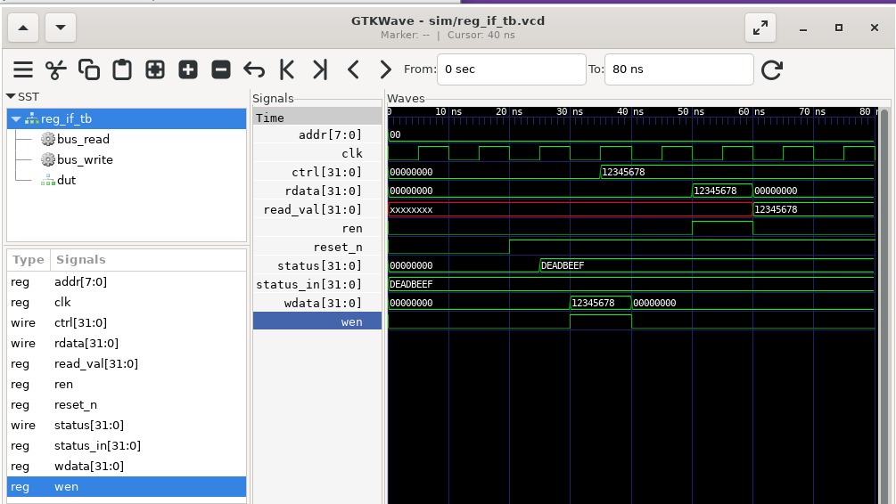
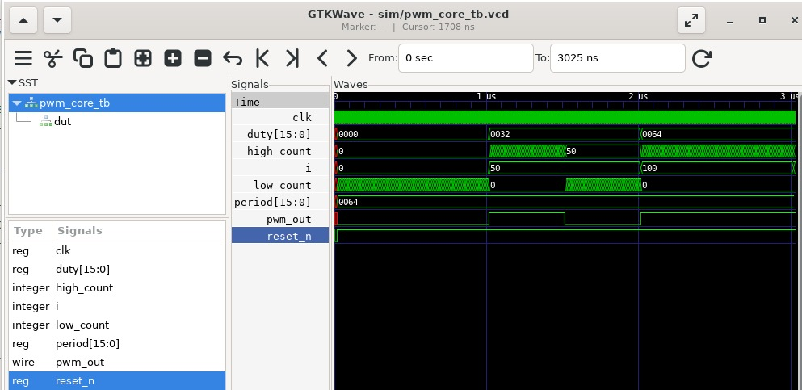
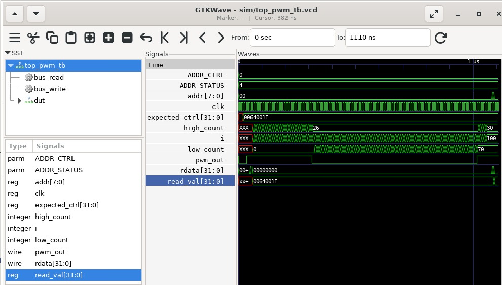

# Testbenches (`tb/`)

Este directorio contiene los **testbenches** utilizados para la verificación funcional de los módulos principales del proyecto **PWM programable**.  
A continuación se describe el propósito, funcionamiento y justificación de cada testbench, así como la razón detrás de la estructura seleccionada.

---

## Estructura del directorio

tb/
├── reg_if_tb.v # Testbench para la interfaz de registros (reg_if)
├── pwm_core_tb.v # Testbench para el núcleo PWM (pwm_core)
└── top_pwm_tb.v # Testbench de integración top-level (top_pwm)


---

## ¿Por qué esta estructura?

- **Separación por módulos**: Cada testbench se enfoca en un nivel de la jerarquía del diseño, facilitando el aislamiento y depuración de errores.
- **Escalabilidad**: Permite agregar más testbenches para futuros módulos o nuevas funciones sin modificar los existentes.
- **Trazabilidad**: Cada testbench tiene su propio archivo fuente, facilitando la organización y documentación de resultados.

---

## Descripción y Funcionamiento de cada Testbench

---

### 1. `reg_if_tb.v` — Testbench de la Interfaz de Registros (`reg_if`)

**Función**:  
Verifica la lógica de acceso por bus a los registros de control y estado, asegurando que las operaciones de escritura y lectura funcionen correctamente bajo las condiciones de protocolo esperadas.

**Características y cobertura:**
- **Secuencia básica:**  
  - Se aplica un reset global.
  - Se realiza una escritura sobre el registro `CTRL` usando las señales de bus.
  - Se lee de vuelta el valor del registro mediante el bus y se verifica su coincidencia.
  - Se verifica la actualización del registro de estado (`STATUS`).
- **Assertions**:  
  - El valor leído debe ser idéntico al valor escrito.
  - El valor de `status` debe reflejar correctamente la entrada.
- **Justificación del testbench:**  
  Permite validar de forma aislada la lógica de bus, asegurando que el bloque de registros opera de forma autónoma y sin dependencias externas.

#### **Espacio para imagen de resultado (GTKWave):**

*Inserta aquí tu captura de GTKWave mostrando el write, read y cambios en status:*




---

### 2. `pwm_core_tb.v` — Testbench del Núcleo PWM (`pwm_core`)

**Función**:  
Verifica el correcto funcionamiento del generador PWM para diferentes configuraciones de periodo y ciclo de trabajo (duty cycle).

**Características y cobertura:**
- **Secuencia:**  
  - Se aplica reset.
  - Se prueba el PWM con diferentes valores de `duty` (0%, 50%, 100%) para un periodo fijo.
  - Se cuentan los ciclos altos y bajos de la salida y se comparan con los valores esperados.
- **Assertions:**  
  - La cantidad de ciclos altos debe coincidir con el valor de duty configurado.
  - La cantidad de ciclos bajos debe ser igual al periodo menos el duty.
- **Justificación del testbench:**  
  Permite garantizar la correcta generación de la señal PWM de manera parametrizable, sin depender de la interfaz de control ni de otros módulos.

#### **Espacio para imagen de resultado (GTKWave):**

*Inserta aquí tu captura de GTKWave mostrando los distintos ciclos de PWM:*



---

### 3. `top_pwm_tb.v` — Testbench Top-Level de Integración (`top_pwm`)

**Función**:  
Ejercita el sistema completo, integrando el acceso por bus, la lógica de control y el generador PWM en una sola prueba de flujo end-to-end.

**Características y cobertura:**
- **Secuencia:**  
  - Aplica reset.
  - Escribe y lee el registro de control por bus.
  - Configura periodo y duty, observa la respuesta del PWM.
  - Verifica que el error flag (`status`) se active si el duty es mayor al periodo.
- **Assertions:**  
  - El valor leído de control debe coincidir con el último valor escrito.
  - La señal PWM debe tener la proporción alto/bajo correcta según la configuración.
  - El flag de error debe activarse correctamente.
- **Justificación del testbench:**  
  Permite validar la interacción de todos los bloques del sistema y garantizar el correcto funcionamiento de la integración final, tal como se implementará en hardware.

#### **Espacio para imagen de resultado (GTKWave):**

*Inserta aquí tu captura de GTKWave mostrando la secuencia completa:*



---

## Valores y detalles relevantes

- Todos los testbenches generan archivos `.vcd` en la carpeta `sim/`, para su visualización en GTKWave.
- Los ciclos de reloj, resets y flancos de bus están perfectamente sincronizados y permiten analizar la temporalidad de los eventos.
- Las comprobaciones y assertions aseguran que cualquier falla se detecta automáticamente en la simulación y en la revisión visual de ondas.

---

## Cómo ejecutar y visualizar los resultados

### Simulación

Desde la raíz del proyecto, usa:

```bash
# Individual
./sim/runsim.sh regif
./sim/runsim.sh core
./sim/runsim.sh top

# Todos los testbenches
./sim/runsim.sh all


gtkwave sim/reg_if_tb.vcd
gtkwave sim/pwm_core_tb.vcd
gtkwave sim/top_pwm_tb.vcd
